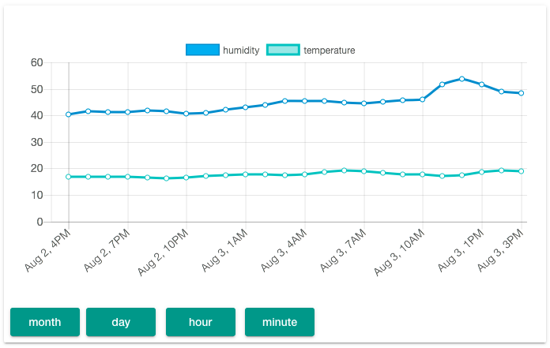

# Home-Sensor 
My home project that monitor temperature and humidity 

##User Story
As a user, I want to know my home current temperature and humidity on my mobile phone.

##Hardware

- Raspberry Pi
- [Adafruit HTU21D-F ( You'll need to solder the header onto the PCB but it's fairly easy and takes only a few minutes even for a beginner. )](https://www.adafruit.com/products/1899)

##Software

*I wanted to test out different technologies so this might not be the most efficient way to get the sensor data.*

I used *Docker* to simplify my deployment process because I wanted to monitor my living room and bed room.

The task is broken down into few components 

### Sensor Reporter 
It reports sensor information to a REST API Interface at a specific interval

### Sensor API
It interacts with a CouchDB container for storing all the sensor information and provide a nice interface to interact with the data

### CouchDB
Store the sensor information 
 
### HTML Chart
A HTML5 application which interface with the Sensor API

###Development

	$ npm install -g typescript tslint typings

##Note
This project is still in it's early stages. I have a few things which I wanted to do as well.

- Setup Travis CI for all modules
- TSLint for all modules
- Documentation
- Automatically setup new couchdb instance
- Implement AppCache on the HTML ( it is 1.6MB in size on production build ) 
